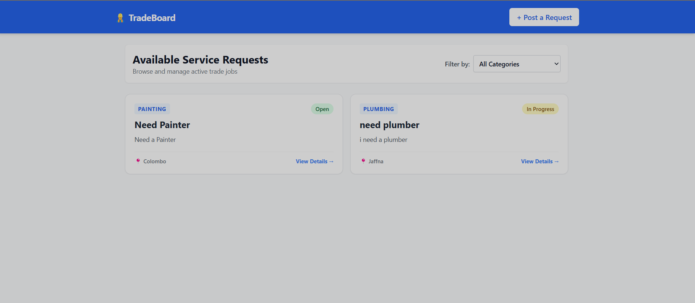
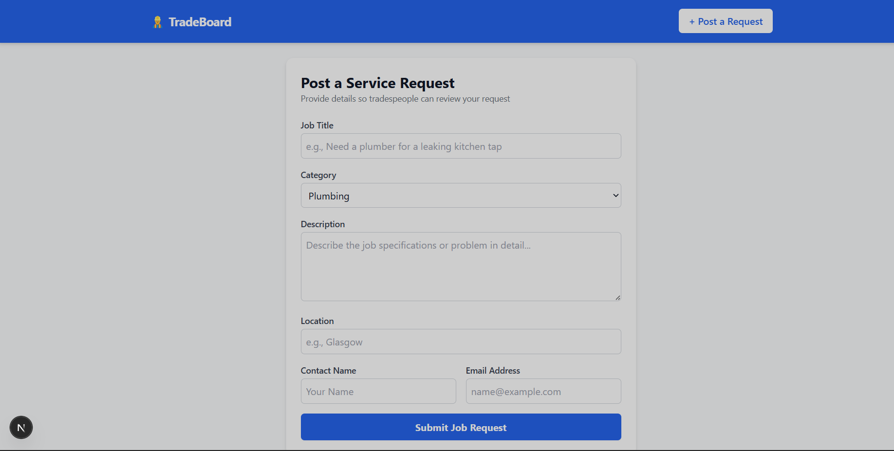
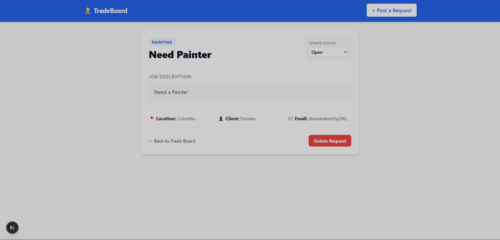

# 👷‍♂️ Mini Service Request Board

A production-ready, full-stack trade platform built for the GlobalTNA Intern Technical Assessment. Homeowners can seamlessly post service requests, while tradespeople can browse active listings, filter requests by professional industry category, track statuses dynamically, and manage database records.

---

## 📸 Application Previews & Screens

### 1. Main Trade Board Dashboard (Screen 1)
Displays all active service requests pulled dynamically from the database, showcasing category tags, description summaries, and current workflow status indicators.



### 2. Post a New Service Request Form (Screen 2)
Includes a fully controlled interface with validation handlers to securely submit job data to the Node API cluster.



### 3. Comprehensive Job Information & Workflow Operations (Screen 3)
A dynamic ID-routed interface enabling status modifications (Open, In Progress, Closed) via discrete backend PATCH adjustments or complete record removal.



---

## 🛠️ System Technology Stack

- **User Interface Engine:** Next.js 15 (App Router Architecture)
- **Styling Architecture:** Tailwind CSS Engine (Direct Utility Engine Injections)
- **Application Server Instance:** Node.js + Express REST API Framework
- **Cloud Database Configuration:** MongoDB Atlas Serverless Instance via Mongoose ODM

---

## 🔑 Environment Keys Configuration

To spin up this repository safely on your local workstation, establish your environment variables using these key-value patterns:

### Backend Configuration Cluster (`/backend/.env`)

```env
PORT=5000
MONGODB_URI=your_mongodb_atlas_cluster_connection_string
```

### Frontend Configuration Keys (`/frontend/.env.local`)

```env
NEXT_PUBLIC_API_URL=http://localhost:5000/api
```

---

## 🚀 Execution and Local Build Guide

Launch two distinct terminal execution panels in your IDE:

### 📡 Booting up the Express REST Engine

```bash
cd backend
npm install
npm run dev
```

The backend ecosystem will securely bind and process events on: `http://localhost:5000`

### 💻 Booting up the Next.js Client User Interface

```bash
cd frontend
npm install
npm run dev
```

Open your web browser of choice and interact directly with the app at: `http://localhost:3000`

---

### Step 3: Update GitHub with the New Files

Now that the images and the updated `README.md` are saved in your folder, let's push them up to GitHub so they display instantly on your repository homepage.

Open your terminal panel and run these final update commands:

```powershell
git add .
git commit -m "Docs: Upgrade README formatting with rich structural descriptions and system screens"
git push origin main
```
